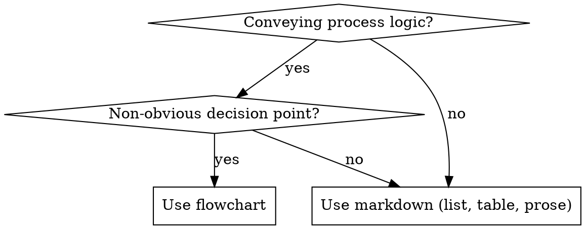

# Skill Quality Standards

Apply these checks when creating or modifying skills.

## Quick Checklist

1. Name follows `^[a-z][a-z0-9]*(-[a-z0-9]+)*(?::[a-z][a-z0-9]*(-[a-z0-9]+)*)*$`; final segment matches directory
2. Description includes trigger phrases AND negative routing ("Not for X — use Y")
3. No persona statements, attribution, or decorative quotes
4. Under 500 lines
5. Self-contained — no references to files outside the skill directory
6. Imperative form in body ("Run X" not "You should run X")
7. Subdirectories limited to `scripts/`, `references/`, `assets/`

## Skill Resolution

All `/skill-tools:*` commands accept flexible skill targets. Resolve `$ARGUMENTS` using these rules in order:

1. **Empty** → discover skills across all scopes, present numbered list, ask user to pick
2. **`all`** or scope keyword (`project`, `global`, `plugin`) → batch mode — discover all matching skills, iterate
3. **Starts with `/` or `./`** → treat as literal path
4. **Bare name** (no slashes) → search in order:
   - `.claude/skills/{name}/SKILL.md`
   - `~/.claude/skills/{name}/SKILL.md`
   - Plugin skills matching `{name}` across installed plugins
   - If multiple matches → present them and ask user to pick
   - If zero matches → error with "No skill found matching '{name}'"

Strip trailing slashes. Validate the resolved path contains `SKILL.md` before proceeding.

### Discovery Paths

| Scope   | Glob pattern                               |
| ------- | ------------------------------------------ |
| project | `.claude/skills/*/SKILL.md`                |
| global  | `~/.claude/skills/*/SKILL.md`              |
| plugin  | Installed plugin `skills/*/SKILL.md` paths |

## Flowcharts

Use `dot`/graphviz flowcharts for non-obvious decision points, process loops, and A-vs-B choices. They replace verbose prose with precise visual logic.

**Never use flowcharts for:** reference material, code examples, linear instructions, or labels without semantic meaning.

**Shape rules:** diamond = question (ends with `?`), box = action (starts with verb), plaintext = literal command, ellipse = state, octagon = warning (STOP/NEVER), doublecircle = entry/exit.

See `references/graphviz-conventions.dot` for the full process DSL with examples.

Render flowcharts to SVG with `/skill-tools:graph`.

## Commands

| Command                    | Purpose                                                  | Modifies files? |
| -------------------------- | -------------------------------------------------------- | --------------- |
| `/skill-tools:lint`        | Structural and content quality review                    | No              |
| `/skill-tools:audit`       | Full quality audit — structure, prose, compliance, scope | No              |
| `/skill-tools:improve`     | Full audit then fix each finding interactively           | Yes             |
| `/skill-tools:adapt`       | Fork and specialize a skill                              | Yes             |
| `/skill-tools:deduplicate` | Find overlap across skills                               | No              |
| `/skill-tools:graph`       | Render flowcharts to SVG                                 | No              |

## Reference Files

Detailed criteria loaded on demand by commands:

- **`references/lint-spec.md`** — frontmatter rules, structure requirements, content quality checks, error codes
- **`references/prose-rules.md`** — active voice, positive form, concrete language, concise expression, token waste patterns
- **`references/compliance-framework.md`** — persuasion principles by skill type, loophole defenses, bright-line rules
- **`references/graphviz-conventions.dot`** — process DSL style guide: node shapes, edge labels, naming patterns
